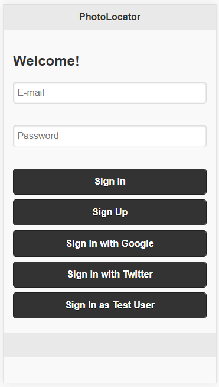
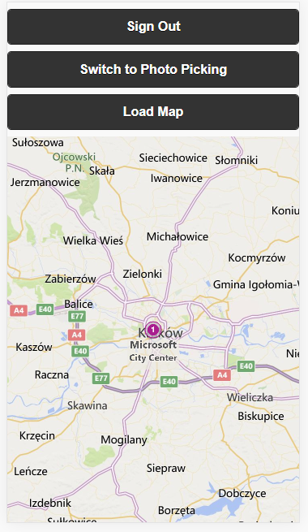
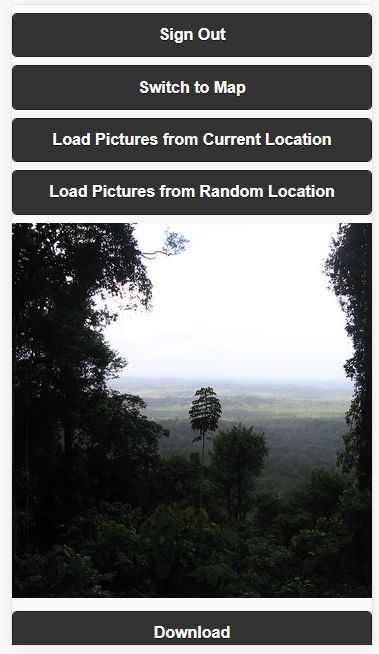
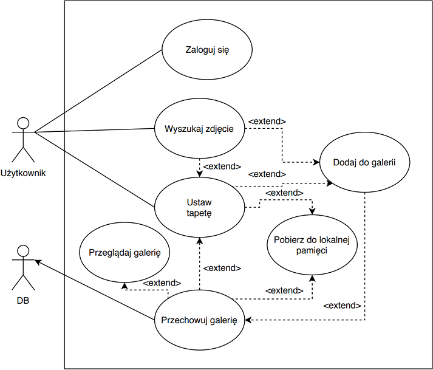

## PhotoLocator

PhotoLocator is an application that suggests You which Google photo to choose for a wallpaper depending on Your location at the moment.

Project is realised as part of Rich Internet Aplications course at Cracow University of Economics

The main requirement is to create an cross-platform app.

The purpose of the application is to help users save photos from where they are at the moment, the pictures are saved in the database, you can always return to them

Sign In possible with e-mail, Google account and Twitter account

Main page with map with Your location

Scroll and pick Your favourite photo

### Use case diagram:

### Go to:

&nbsp;
&nbsp;

### Created by

Joanna Grochal 
Gabriela Łupak 
Piotr Korzeń 
Kamil Luśnia
